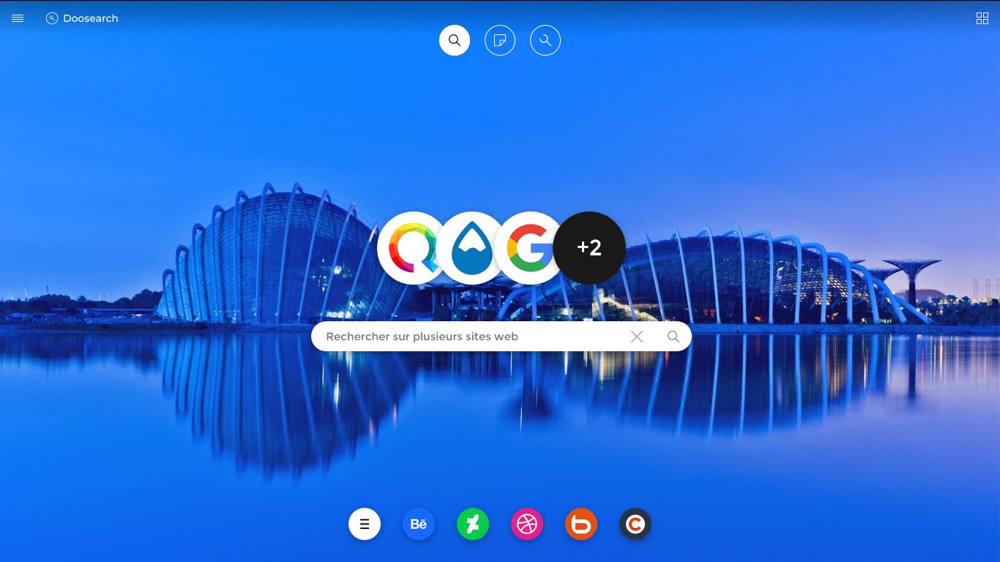

# Doosearch
Page d'accueil pour navigateur web

## Qu'est-ce que c'est ?
Doosearch est une page web qui propose en une page d'accueil un formulaire de recherche avec la possibilité de lancer une recherche vers plus de 100 sites web différents (dont Google, Bing, DuckDuckGo et Qwant).
Cette page d'accueil peut-être accompagnée d'un "Speed dial" (Accès rapide pour les intimes) qui permet aux utilisateurs d'épingler leurs sites web favoris.

## Pouvons-nous le tester ?
Oui, sans doute ! Une version en ligne est mis à disposition à l'adresse suivante : http://search.doocode.xyz/, il s'agit de la version 1.3, actuellement sur Github (vous y êtes).

## Je suis un développeur web
Hello world! Le wiki vous explique comment installer Doosearch sur votre serveur : [https://github.com/Doocode/Doosearch/wiki](Wiki).

Par Aero15